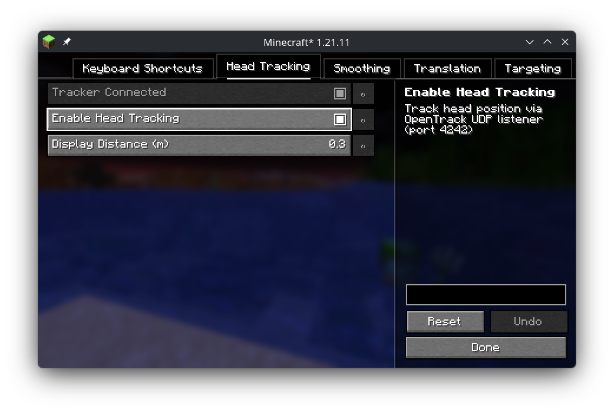

# Correct Gaming Posture

Flat screen pseudo-VR with webcam headtracking. - Look around corners by moving your head IRL.

- Main feature: Become mindful of your gaming posture!

## Version 1.0.0

First polished release. Reworked namespace to not interfere with Simple Camera Tweaks, and removed its functionality from this mod. They are compatible!

## Requirements

Just a regular webcam, better hardware also supported. Developed with a PS3 Eye.
Get Opentrack and run it https://github.com/opentrack/opentrack

On Linux Opentrack requires ONNX as a dependency to build NeuralNet Tracker!

New low-latency filter for Opentrack in the works! Watch this space!

## Use
1. Get Opentrack, may have to compile it yourself with ONNX to get NeuralNet Tracker input on Linux
2. Start Opentrack on output UDP, 1270.0.0.1 port 4242 (default)
3. Load mod with Minecraft, use Mod Menu to enable Headtracking in its tab and make sure the tracker is connecting, adjust the settings if needed. 1€ filter is the same as Opentrack's Accela
4. Correct Gaming Posture!

## Current Features

- Head-tracking camera translation with configurable gains and bounds
- Optional 1€ smoothing filter (`OFF` or `ONE_EURO`)
- Head-tracking toggle
- Targeting mode toggle (`VANILLA` or `ALIGNED`)
- Experimental predictive targeting assist (off by default)

## Credits

- Idea and implementation by ganzuul / dr_nos
- Base mod by [Blexyel](https://github.com/Blexyel)
- Original project: [Simple Camera Tweaks](https://modrinth.com/mod/simple-camera-tweaks)

## Migration Notes

- Existing configs at `config/simple_camera_tweaks.json` are automatically migrated to `config/correct_gaming_posture.json` on first launch.
