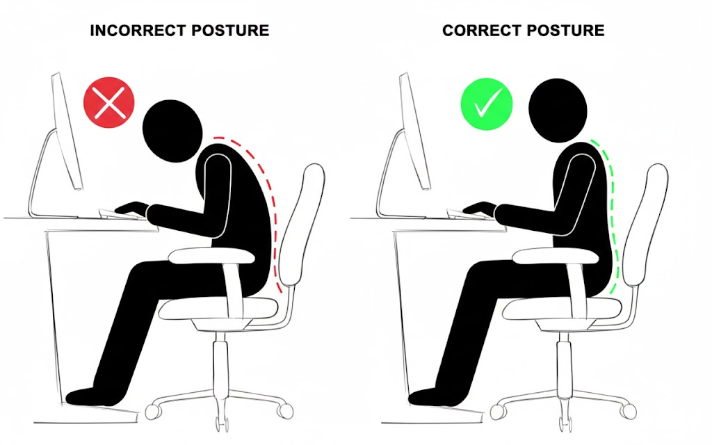
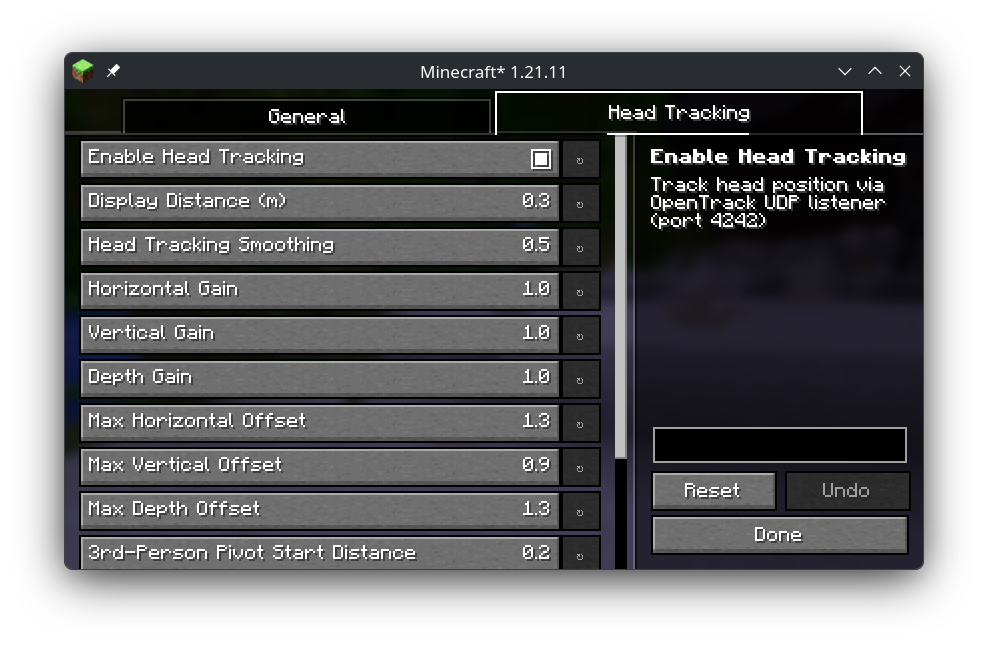

# Correct Gaming Posture

Flat screen pseudo-VR with webcam headtracking. - Look around corners by moving your head IRL.

## 1st Public Release

Base functionality working as desired. You may want to tweak the settings, in particular the view distance.

## Requirements

Just a regular webcam, better hardware also supported.

## Use

1. Get Opentrack, may have to compile it yourself with ONNX to get NeuralNet Tracker input
2. Start Opentrack with UDP output to `127.0.0.1` on port `4242`
3. Load mod with Minecraft, open Mod Menu, and enable Head Tracking in the Correct Gaming Posture tab
4. Correct Gaming Posture!

## Current Features

- Head-tracking camera translation with configurable gains and bounds
- Optional 1€ smoothing filter (`OFF` or `ONE_EURO`)
- Third-person head-tracking toggle
- Targeting mode toggle (`VANILLA` or `ALIGNED`)
- Experimental predictive targeting assist (off by default)

## Credits

- Base mod by [Blexyel](https://github.com/Blexyel)
- Original project: [Simple Camera Tweaks](https://modrinth.com/mod/simple-camera-tweaks)

## Migration Notes

- Existing configs at `config/simple_camera_tweaks.json` are automatically migrated to `config/correct_gaming_posture.json` on first launch.
